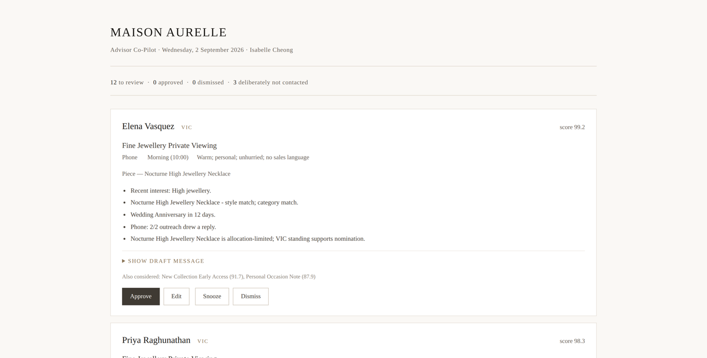

# Luxury Advisor Co-Pilot

A daily brief for luxury client advisors. It reads five tables and produces
one ranked list: which client to approach today, with which piece, on which
channel, at what time, in what tone — and for some clients, a recommendation
to say nothing at all.

**[▶ Live app](https://luxury-copilot.streamlit.app)** ·
**[📄 Today's brief](https://adrita333.github.io/luxury-copilot/)** ·
[📓 Build notebook](https://github.com/Adrita333/luxury-copilot/blob/main/Luxury_Advisor.ipynb)

*The static brief rebuilds itself every morning at 07:00 IST via GitHub Actions —
the date in its header is today's.*

## The data

| File | Grain | Rows |
|---|---|---|
| `clients.csv` | one client | 15 |
| `products.csv` | one piece | 25 |
| `opportunities.csv` | one outreach play | 8 |
| `interactions.csv` | one conversation | 52 |
| `purchases.csv` | one receipt line | 60 |

## How it works

**Gates run before scoring and cannot be outvoted.** Consent, cooling-off
periods, frequency caps and explicit refusals are absolute. A system that
scores first and filters afterwards will eventually let a persuasive score
talk it past something a client asked for.

**What survives is scored on six dimensions** — relevance, timing, channel
fit, exclusivity fit, relationship strength and contact restraint.

**Every recommendation carries its evidence**, citing the rows it used.

## Today's output

15 clients reviewed, 12 approaches proposed, 3 deliberately left alone,
1 flagged for advisor approval where a personal occasion conflicts with a
cooling-off rule.

## The tests

    python -m pytest -q          # 13 tests, ~1s

The claim above — that gates cannot be outvoted by a score — is true on the
day it is written and quietly stops being true three refactors later. These
hold it in place.

The occasion exception is where the care is needed. A time-critical occasion
may waive **cooling-off**; it may never waive consent, never the frequency
cap, and never silently. Those are three separate promises, so they are three
separate tests:

| Test | What breaks it |
|---|---|
| An occasion cannot rescue a client who withdrew consent | The consent check is dropped from `occasion_exception` |
| An occasion cannot waive the contact cap | The frequency check is dropped from it |
| A waived cooling-off is always flagged for approval | The waiver text stops saying APPROVAL REQUIRED |
| A client-level block is never overridden by a score | Anything but cooling-off becomes waivable |
| Every refusal states its reason | A held-back client is returned with no evidence |
| No draft is written for a client not being contacted | A message is prepared that could be sent by accident |
| Running twice gives the same brief | A draft stops being a template |

Each was checked by breaking it. Removing the consent line from
`occasion_exception` fails the first; removing the frequency line fails the
second; changing the waiver text fails the third. A test that cannot fail is
not evidence.

## Design note

This is a co-pilot, not an agent. It automates the noticing, never the
saying. Drafts are templates rather than generated text, so every
recommendation is auditable — an LLM would sit in the drafting layer,
under the same tone rules, with the advisor still approving every send.

Data is entirely synthetic.
